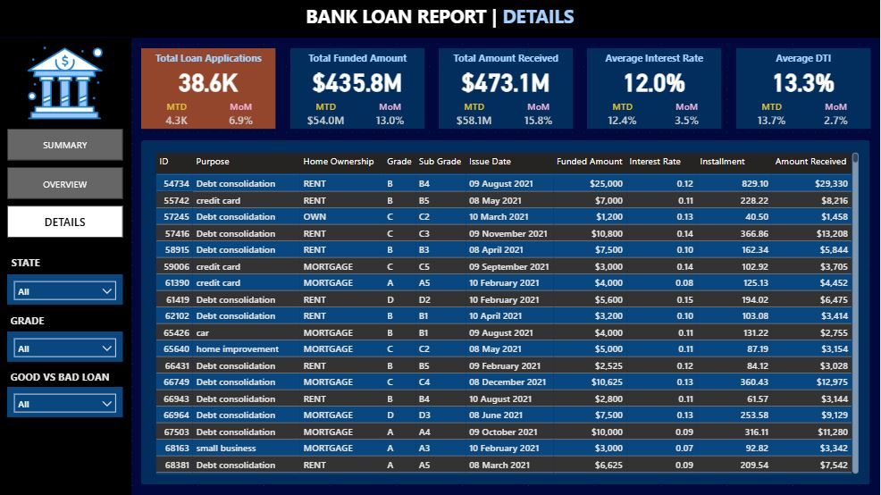

# Bank Loan Report & Risk Analysis

> **Project Status:** Completed (November 2025)

---

## 1. Project Objective

The primary objective of this project was to create a comprehensive Bank Loan Report to monitor and assess the bank's lending activities, track portfolio health, and identify trends to inform lending strategies.

The final solution is a multi-dashboard Power BI report designed to provide insights into key metrics, analyze loan performance, and support data-driven decision-making. The report is built in three sections, as per the business requirements:

* **Dashboard 1: Summary**
* **Dashboard 2: Overview**
* **Dashboard 3: Details**

---

## 2. Dashboard 1: Summary Dashboard

This dashboard serves as the main high-level monitor, tracking key performance indicators (KPIs).

* **Core KPIs Tracked:**
    * Total Loan Applications
    * Total Funded Amount
    * Total Amount Received
    * Average Interest Rate
    * Average Debt-to-Income Ratio (DTI)
* **Time-Series Metrics:** All core KPIs were calculated with **Month-to-Date (MTD)** and **Month-over-Month (MoM) changes** to track performance over time.
* **Good vs. Bad Loan Analysis:**
    * **Good Loans** (defined as 'Fully Paid' and 'Current') were analyzed for application percentage, total funded amount, and total received amount.
    * **Bad Loans** (defined as 'Charged Off') were analyzed for application percentage, total funded amount, and total received amount.
* **Loan Status Grid View:** A comprehensive grid view was created to display all key metrics categorized by their current 'Loan Status'.

---

## 3. Dashboard 2: Overview Dashboard

This dashboard provides deep-dive visual analysis of the portfolio across various borrower and loan parameters.

* **Monthly Trends (Line Chart):** Visualizes 'Total Loan Applications,' 'Total Funded Amount,' and 'Total Amount Received' over time to identify seasonality.
* **Regional Analysis (Filled Map):** Maps lending metrics by state to identify regions with high lending activity.
* **Loan Term & Purpose (Donut/Bar Charts):** Provides breakdowns of loan metrics by term (e..g., 36/60 months) and purpose (e.g., debt consolidation).
* **Borrower Analysis (Bar/Tree Map):** Illustrates loan metrics distributed by borrower employment length and home ownership status (e.g., own, rent, mortgage).

---

## 4. Personal Analysis & Key Insights

Beyond the dashboard requirements, I used **Python (Jupyter Notebooks, Pandas)** for in-depth data cleaning and **SQL** to verify key metrics.

My analysis of the **$435.76 million portfolio** (38.5K applications) quantified the *true* cost of risk:
* **Key Insight:** The portfolio was segmented into Good Loans (86.18%) and Bad Loans (13.82%). My analysis concluded that the "Bad Loans" (Charged Off) were responsible for a **$28.25 million net loss**.

---

## 5. Technologies Used

* **Power BI:** (DAX Measures, Data Modeling, 3-Dashboard Report)
* **Python:** (Jupyter, Pandas, NumPy, Matplotlib) for data analysis and validation.
* **SQL:** (Data Querying & Metric Verification)
* **Excel:** (Supplementary Dashboards & Data Validation)

### Dashboard Visuals

